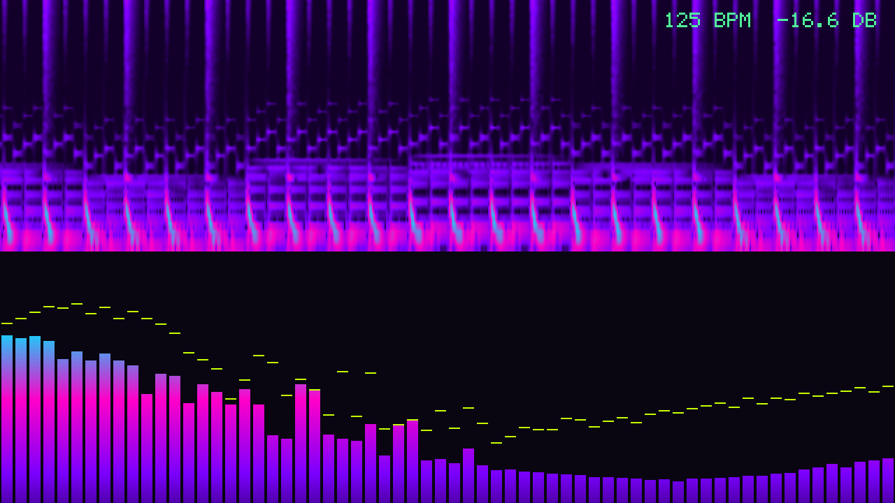
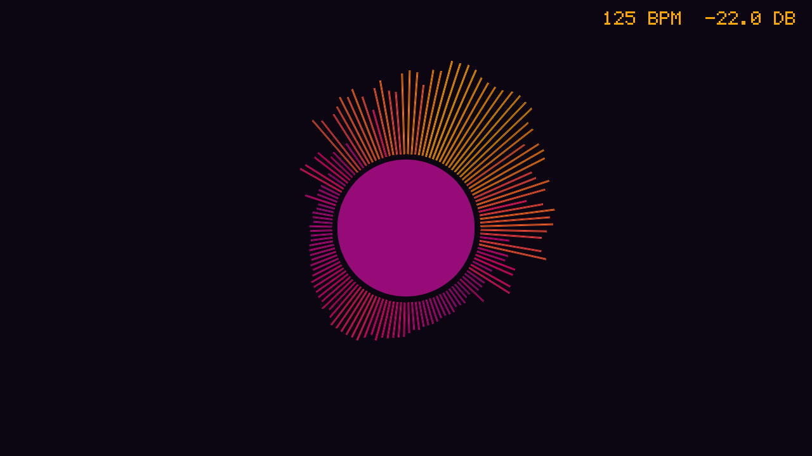
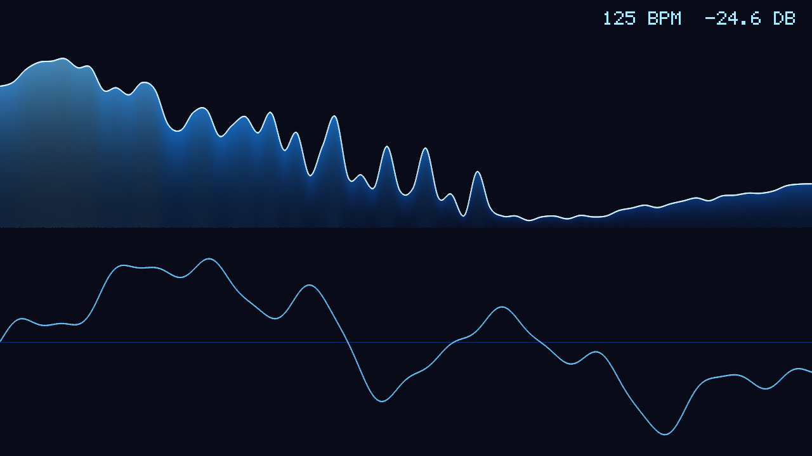
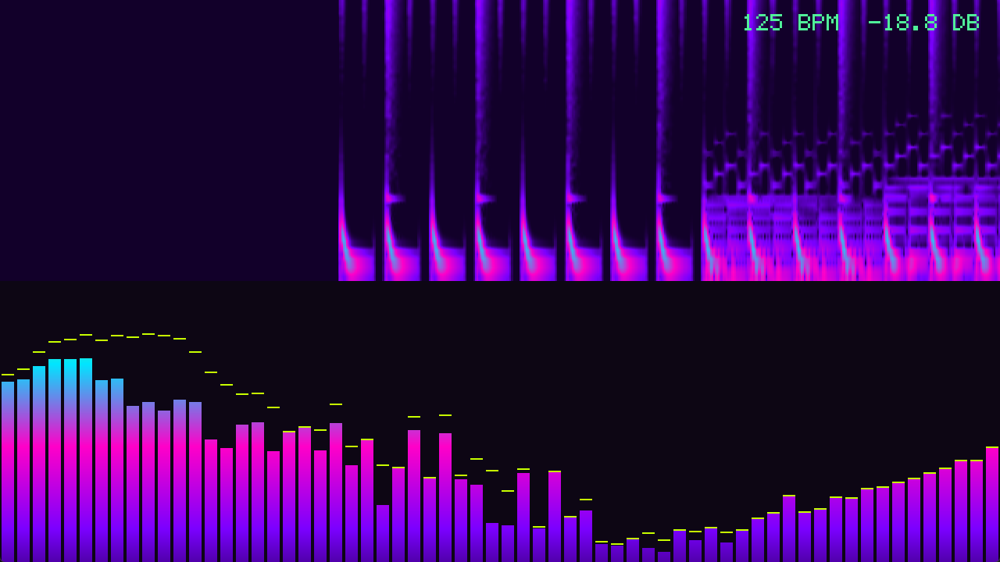

# mviz

A real-time music visualizer. It shows what your computer is playing, a microphone, or a music file it plays itself: an FFT turns the audio into frequency bands, beats and a tempo, and six effects draw them. For anyone who wants something to look at with their music, or a starting point for audio-reactive graphics; the analysis is written to be read.

**Status:** v0.1.0, working on Windows 11 (the only system it was run on). Not published to crates.io; build from source.



## Features

- **Sources:** whatever the computer is playing (WASAPI loopback on Windows, no virtual cable needed), a microphone or other input, or a file (MP3, AAC/M4A, FLAC, Ogg Vorbis, WAV) played through the default output and drawn in step with what you hear.
- **Analysis:** 64 bands (configurable) on a logarithmic scale from 30 Hz to 16 kHz, calibrated so a full-scale sine reads 0 dB; attack and release smoothing; falling peak markers; the RMS level; an oscilloscope trace that stands still for steady tones; beats from spectral flux in the kick drum range with an adaptive threshold; and the tempo.
- **Effects:** bars, mirrored bars, a filled spectrum line, an oscilloscope, a scrolling spectrogram and a radial burst, stacked in any combination and proportion; six palettes or your own gradient; a background flash on beats; the tempo and level in the corner.
- **Offline:** `--render` writes one frame of a file as a PNG; `--export` renders a whole file to an MP4 with its audio (through ffmpeg).

## How to install

Requires a recent stable Rust (built and tested with 1.98.1). On Windows nothing else; on Linux the ALSA development files (`libasound2-dev` or `alsa-lib-devel`). For `--export`, ffmpeg on the PATH.

```sh
git clone https://github.com/r3clusionn/music-visualizer
cd music-visualizer
cargo install --path .
```

This installs the `mviz` binary. It uses two other libraries of mine: [adsp](https://github.com/r3clusionn/audio-dsp-library) for the FFT, windows and resampling, and [lumen](https://github.com/r3clusionn/image-library) for writing PNGs.

## How to use

```sh
mviz                                   # what the computer is playing
mviz song.flac                         # play a file and show it
mviz --mic                             # the default microphone
mviz --device "Headphones"             # capture another output (or input with --mic)
mviz --list-devices
mviz -e spectrogram,bars -p fire       # effects top to bottom, a palette
mviz song.mp3 --render frame.png --at 42.5 --size 1920x1080
mviz song.mp3 --export song.mp4 --size 1920x1080
```

| Key | What it does |
|---|---|
| `1` to `6` | Bars, mirror, line, wave, spectrogram, radial. |
| `0` | Spectrogram above bars. |
| `P` | Next palette. |
| `Up`, `Down` | More or less sensitive (moves the level treated as silence by 5 dB). |
| `H`, `F` | Hide the tempo and level; turn the beat flash off. |
| `Space`, `Left`, `Right` | Pause, back and forward 5 seconds (files). |
| `Q`, `Esc` | Quit. |





### Configuration

`mviz --config look.toml`; every setting is optional.

```toml
width = 1280
height = 720
fps = 60
palette = "neon"                        # fire, ice, neon, forest, mono, sunset, or a list:
# palette = ["#000000", "#3b0764", "#f472b6", "#fde68a"]
background = "#080610"
panels = [{ effect = "spectrogram", weight = 1 }, { effect = "bars", weight = 2 }]
flash = true
peaks = true
hud = true
bar_gap = 0.2                           # fraction of each bar's slot
scroll = 120                            # spectrogram, pixels per second
wave_gain = 1.0

[analysis]
fft_size = 4096
bands = 64
min_hz = 30
max_hz = 16000
db_floor = -70                          # levels map to 0..1 between these
db_ceil = 0
attack = 0.015                          # seconds
release = 0.18
peak_hold = 0.35
peak_fall = 0.9
beat_sensitivity = 2.0
```

## How it works

- **Bands.** A 4096-sample Hann-windowed FFT (adsp's real FFT). Each band sums the power of the bins inside it and converts it to the amplitude of a sine with the same energy (2 sqrt(P / (N sum w^2))), so a full-scale tone reads 0 dB whatever the band's width. Low bands narrower than one bin (below about 100 Hz at 48 kHz) use the magnitude interpolated at their centre instead.
- **Beats.** A long FFT smears a drum hit over 85 ms, so onsets come from a separate 1024-sample transform that runs every 512 samples over all audio that arrived since the last frame: what it finds does not depend on the frame rate. The onset strength is the spectral flux (the sum of rises in log-compressed magnitude) between 40 and 120 Hz. A beat needs the flux above the mean plus two standard deviations of the last second, above 60% of the strongest onset of the last few seconds (which keeps a bass line from counting and adapts to the volume), and at least 0.25 s after the previous beat. The tempo is the median gap between recent beats, folded into 70 to 180 BPM.
- **Sync with a file.** The output callback counts the frames it hands to the device; the frame being heard is that count minus the latency the device reports for each callback, and the analysis window ends there. Files are converted once to the device's rate with adsp's polyphase resampler.
- **Rendering** is software only, into a 0xRRGGBB buffer that minifb shows: rectangles, Wu anti-aliased lines, circles and a 5x7 bitmap font. The spectrogram keeps its own image and scrolls it by whole pixels at a fixed speed, carrying the remainder between frames.

## Measurements

Intel Core i9-14900KF, Windows 11, Rust 1.98.1, release build; `cargo run --release --example bench` on 20 seconds of the demo track at 60 frames per second, median per frame:

| Work per frame | 1920x1080 | 1280x720 |
|---|---|---|
| Analysis (64 bands and the beat detector) | 0.028 ms | 0.028 ms |
| Bars | 1.30 ms | 0.79 ms |
| Mirror | 0.28 ms | 0.12 ms |
| Line | 2.68 ms | |
| Wave | 0.36 ms | |
| Spectrogram | 0.70 ms | 0.31 ms |
| Radial | 1.12 ms | |

Running live in a 1280x720 window at 60 frames per second (`scripts/live_check.py`, 5 seconds measured with psutil), mviz used 6.2% of one CPU core and 25 MB of memory showing a file, and 3.7% and 18 MB capturing what the computer was playing.

Profiling the first version of these numbers showed the line effect at 42 ms per 1080p frame: it looked up a palette colour and blended in floating point for every filled pixel. Blending in 8-bit fixed point and taking one colour per column brought it to 2.7 ms (and the radial effect from 8.5 to 1.1 ms).

## Verification

- `cargo test --release`: 19 tests. Clippy reports nothing.
- **Calibration.** A full-scale sine at 50 Hz, 440 Hz, 1 kHz, 5 kHz and 12 kHz lands in the band that contains it and reads 0 dB within 1.5 dB; a -20 dB sine reads -20 dB; the RMS of a 0.1 sine reads -23 dBFS. Smoothing rises within 50 ms and falls to nothing within a second; peaks fall after their hold.
- **Beats against known kicks.** `src/demo.rs` synthesizes a track (kick on every beat, snare, hi-hats, a bass line on eighths, chords and an arpeggio) and returns when each kick starts. At 90, 124 and 140 BPM the detector, run frame by frame as the live loop runs it, finds every kick (61, 59 and 59) within 32 ms, with 1, 2 and 2 extra beats; the tempo reads within 3% of the truth. At 30 and 144 frames per second it finds all 59 kicks of the first 30 seconds at 124 BPM, with 1 and 2 extra (the test requires at least 90%). Silence gives no beats.
- **How the settings were chosen.** A sweep over the onset compression, threshold and frequency range (`examples/beat_tune.rs`) showed the first design counting the bass line as beats (47 extra at 90 BPM) because strong log compression made quiet bass onsets as large as kicks, and missing kicks at 30 frames per second because the onset window was shorter than a frame. The detector now runs on its own 512-sample hop and requires 60% of the recent peak; these settings were tuned on this synthesized track, not on recordings (see Limits).
- **Offline output.** A rendered frame is a valid PNG of the requested size (decoded again with lumen) and is identical when rendered twice; WAV written by adsp decodes through symphonia to the same samples (within one 16-bit step); a 1 kHz tone resampled from 44.1 to 48 kHz still peaks in the band holding 1 kHz.
- **Effects** draw without panicking at 1x1, 3x2, 2000x3, 7x900 and 640x360; bar heights match their levels to the pixel; the spectrogram scrolls by the right number of columns for the elapsed time.
- **A real window.** `scripts/live_check.py` starts mviz, finds its window, captures it and measures CPU; the capture below is from that run (the demo track's drum-only intro scrolling out of the spectrogram as the full arrangement starts).



## Limits

- Loopback capture is a WASAPI feature: on Linux, use `--mic` with a PulseAudio or PipeWire monitor source; on macOS a virtual device is needed. Only Windows 11 was tested.
- The beat detector's settings were tuned on the synthesized track (see Verification); real recordings, where kick drums vary in level and the bass may be louder than the kick, were not measured, so expect more missed or extra beats there.
- File playback needs an output device that takes 32-bit float samples (Windows shared-mode devices do).
- Files are decoded completely into memory before playing (about 35 MB per minute of 48 kHz stereo after resampling, with the mono copy the analysis reads).
- No full-screen mode, no shaders or GPU rendering, no playlist.

## License

MIT (see `LICENSE`).
